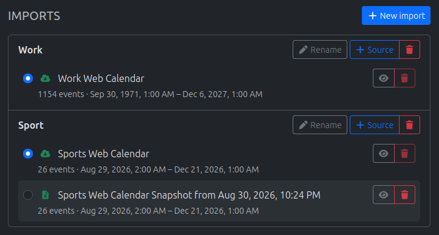
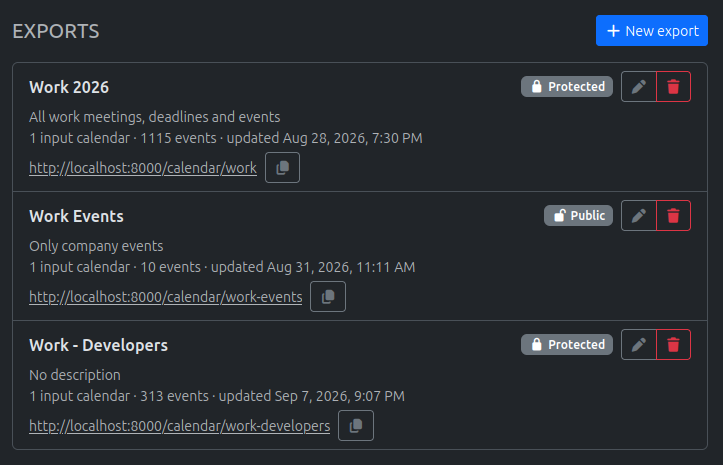
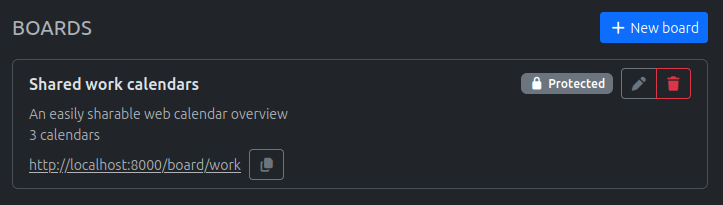

# Calendar Manager

A web service for managing calendar sources, combining and filtering calendar events and providing subscribable web calendars.



First create calendar imports either from static file uploads or by subscribing to web calendars via their URL.
The web calendar subscription can be used standalone to provide a passive backup.
Calendar imports are the source of events for calendar exports.



Exports collect events from selected calendar imports.
An optional filter rule can be applied to filter the exported events via predicates such as text contained in title and description or by date range.
Calendars are processed on the backend and updated when the source or filter rule changes.
A public link is created for each calendar export with an optional secret token for access control.



Finally, share multiple calendars with others on a calendar board.
Here they can select the calendar that best fits their needs and subscribe to it via the provided link.


## Usage

```bash
git clone https://github.com/lukasstorck/calendar-manager.git
cd calendar-manager

cp .env.example .env
docker compose up --build
```

Web app: http://localhost:8000

### Example use cases

#### Backup external web calendars

Common web calendars can be
- volatile, e.g. old events might get deleted from the source
- untrusted, e.g. source might get edited/manipulated
and providers usually do not provide backup solutions.
Simply having a calendar import with the backup feature activated will save all changes to the calendar as snapshots.
It can also be used to observe changes made to the source.

#### Create partial calendars

The simple filter rule predicate logic can be used to filter out unwanted events.
It can also be used to create smaller calendar files, e.g. by removing old events, in case the source is too large to be imported into the calendar application.

#### Link shortener

The public link for an exported web calendar can be set to short, static and memorizable URLs.

#### Sports Team Calendar Manager

A trainer might have multiple training groups with sessions across the week and competitions on weekends.
With the calendar manager the trainer can import an existing calendar and create separate exports.
Each training group could for example be filtered via the event title or there could be different calendars with only the competitions for parents or club supporters.
The boards can be used to provide the calendar links along side a description.


### TODO

- rename field: press enter to confirm or escape to cancel

- add documentation strings for all apis (so that they can be read by swagger)

- if no auth provider is set, application should run in single-user mode
  - the auth should return a static user
  - still show and use start-page, log-in and log-out buttons
  - maybe log-in should directly call log-in api if no auth providers are comunicated to the client (nothing to show in login offcanvas)

- rework filter rules
- rework scheduler
- move auth.py into src/api/
- move const vars from auth.py into config.py
- maybe use pydantic for config.py

### BACKLOG

- allow multi-line in descriptions

- admin panel

- show detailed changes between web cal and/or static file versions
- display calendar events

- add frontend display format options
  - use "10 minutes ago" for e.g. last update of web calendar
  - different fmtDateTime strings with example output
    - 12h/24h time
    - date order
    - date and time separators
  - change date range display format for long ranges, e.g. when there are multiple years, only show years, or with same year, only show day, months and times

- add "add rule to description" for calendar exports (three options: no, raw rule, interpreted sentence "from ... to ... " instead of from:... to:...)

- read healthcheck from calendar gateway
