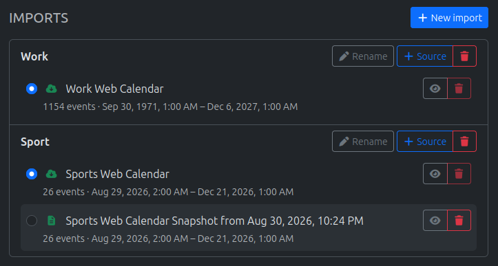
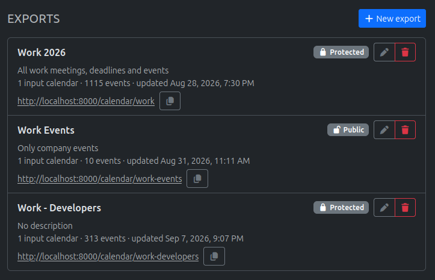
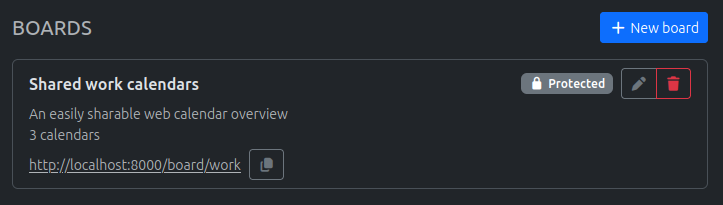

# Calendar Manager

A web service for managing calendar sources, combining and filtering calendar events and providing subscribable web calendars.



First create calendar imports either from static file uploads or by subscribing to web calendars via their URL.
The web calendar subscription can be used standalone to provide a passive backup.
Calendar imports are the source of events for calendar exports.



Exports collect events from selected calendar imports.
An optional filter rule can be applied to filter the exported events via predicates such as text contained in title and description or by date range.
Calendars are processed on the backend and updated when the source or filter rule changes.
A public link is created for each calendar export with an optional secret token for access control.



Finally, share multiple calendars with others on a calendar board.
Here they can select the calendar that best fits their needs and subscribe to it via the provided link.


## Usage

```bash
git clone https://github.com/lukasstorck/calendar-manager.git
cd calendar-manager

cp .env.example .env
docker compose up --build
```

Web app: http://localhost:8000

### Example use cases

#### Backup external web calendars

Common web calendars can be
- volatile, e.g. old events might get deleted from the source
- untrusted, e.g. source might get edited/manipulated
and providers usually do not provide backup solutions.
Simply having a calendar import with the backup feature activated will save all changes to the calendar as snapshots.
It can also be used to observe changes made to the source.

#### Create partial calendars

The simple filter rule predicate logic can be used to filter out unwanted events.
It can also be used to create smaller calendar files, e.g. by removing old events, in case the source is too large to be imported into the calendar application.

#### Link shortener

The public link for an exported web calendar can be set to short, static and memorizable URLs.

#### Sports Team Calendar Manager

A trainer might have multiple training groups with sessions across the week and competitions on weekends.
With the calendar manager the trainer can import an existing calendar and create separate exports.
Each training group could for example be filtered via the event title or there could be different calendars with only the competitions for parents or club supporters.
The boards can be used to provide the calendar links along side a description.


### Filters and transforms

Each source in a calendar export has its own filter and transform.
The filter selects which events of the import are kept, then the transform modifies the kept events.

#### Filters

A filter is an SQL `WHERE` clause (SQLite) evaluated against every event of the import.
Events that match are kept, an empty filter keeps all events.

| Field             | Description                                                             |
| ----------------- | ----------------------------------------------------------------------- |
| `summary`         | Event title (text)                                                      |
| `description`     | Event description (text)                                                |
| `location`        | Event location (text)                                                   |
| `uid`             | Unique event id (text)                                                  |
| `dtstart`         | Start, ISO 8601 in UTC (text)                                           |
| `dtend`           | End, ISO 8601 in UTC, derived from the duration if missing (text)       |
| `duration`        | Length in seconds, derived from start and end if missing (number)       |
| `"all-day"`       | `1` for all-day events, `0` for timed events                            |
| `status`          | `TENTATIVE`, `CONFIRMED` or `CANCELLED` (case-insensitive)              |
| `class`           | `PUBLIC`, `PRIVATE` or `CONFIDENTIAL` (case-insensitive)                |
| `transp`          | `OPAQUE` (busy) or `TRANSPARENT` (free) (case-insensitive)              |
| `sequence`        | Revision number (number)                                                |
| `url`             | Event URL (text)                                                        |
| `created`         | Creation time, ISO 8601 in UTC (text)                                   |
| `"last-modified"` | Last modification time, ISO 8601 in UTC (text)                          |
| `dtstamp`         | Timestamp of the event's creation by the source, ISO 8601 in UTC (text) |

Notes:
- Field names containing a hyphen must be quoted: `"all-day"`, `"last-modified"`.
- `REGEXP` is available: `summary REGEXP '^Meeting'`.
- `GLOB` is available: `summary GLOB 'Meeting*'`.
- `DURATION('PT1H30M')` converts an ISO 8601 duration to seconds: `duration > DURATION('PT2H')`.
- Dates are stored as text in UTC. Wrap both sides in `datetime()` when comparing, otherwise the comparison is a plain string comparison, which breaks across timezones. `datetime()` converts values with a UTC offset (e.g. `+01:00`) to UTC, so you can write bounds in your local time.

Examples:

```sql
summary LIKE '%standup%' AND "all-day" = 0
summary GLOB 'Training *' AND location GLOB '*Hall [12]'
summary REGEXP '^(Training|Match)' AND status != 'CANCELLED'

-- all events between 2026-01-01 UTC and 2026-07-01 12:30 (UTC+5)
datetime(dtstart) >= datetime('2026-01-01') AND datetime(dtstart) < datetime('2026-07-01T12:30:00+05:00')

-- all events after 2021, but without summer of 2025
datetime(dtstart) >= datetime('2021-01-01') AND NOT (
  datetime(dtstart) >= datetime('2025-06-01')
  AND datetime(dtstart) < datetime('2025-09-01')
)

duration > DURATION('PT2H')
```

#### Transforms

A transform is a space-separated list of commands.
Commands run in order, from left to right.
Values containing spaces must be quoted: `set-location:"Room 1"`.
Durations use the ISO 8601 format, e.g. `PT15M`, `PT1H30M`, `P1D`.

| Command                        | Description                                                                                            |
| ------------------------------ | ------------------------------------------------------------------------------------------------------ |
| `shift:<duration>`             | Move the event by a duration, may be negative (`shift:PT1H`, `shift:-PT30M`)                           |
| `clip-min-duration:<duration>` | Extend events shorter than the duration to exactly that length                                         |
| `clip-max-duration:<duration>` | Shorten events longer than the duration to exactly that length                                         |
| `set-<property>:<value>`       | Overwrite an event property (`set-location:"Room 1"`, `set-summary:Busy`)                              |
| `remove:<property>`            | Delete an event property (`remove:description`), `remove:extra-properties` deletes all `X-` properties |
| `overlap-trim-end`             | Where events overlap, end the earlier event when the later one starts                                  |
| `overlap-trim-start`           | Where events overlap, start the later event when the earlier one ends                                  |
| `combine-all-day`              | Merge consecutive all-day events with the same title into one multi-day event                          |

Notes:
- `shift`, `clip-*` and `overlap-*` only affect timed events, all-day events are left unchanged.
- `set-uid`, `set-dtstart`, `set-dtend` and `set-duration` are not allowed, use `shift` and `clip-*` to change event times.
- `uid`, `dtstamp`, `dtstart`, `dtend` and `duration` can not be removed.
- `overlap-*` and `combine-all-day` take no value.
- Unknown commands and invalid durations are rejected when saving the export.

Example:

```
shift:PT1H set-location:"Room 1" remove:description remove:extra-properties
```


### TODO

- bug: calendar export source field validation: error is set on wrong field
- bug: setting error in ui is interrupting work flow by focusing different field

- normalize calendar file before saving -> google seems to be inconsistant with order -> should have same hash for change detection
- add documentation strings for all apis (so that they can be read by swagger)


### BACKLOG

- add non 200 http codes into pydantic documentation
- bug: web calendar details are not updated when opened after a new version was fetched whilie the stored version show the updated information

- allow multi-line in descriptions

- admin panel

- show detailed changes between web cal and/or static file versions
- display calendar events

- add frontend display format options
  - use "10 minutes ago" for e.g. last update of web calendar
  - different fmtDateTime strings with example output
    - 12h/24h time
    - date order
    - date and time separators
  - change date range display format for long ranges, e.g. when there are multiple years, only show years, or with same year, only show day, months and times

- calendar export sources filter/transform user input rework:
  - a canvas with movable (drag and drop) building blocks
    - source: all events of a calendar input source
    - filter: an SQL WHERE clause with two output groups, the events that match and those that don't
    - transform: operators that are applied to events, has transformed events as output
    - export: a single sink block, which collects all connected events into the output calendar
  - blocks are connected with lines, which pass on the grouped events to the next block
  - there can be multiple source, filter and transform blocks, but only a single export block
  - there can be multiple output and input lines from and to each block, which duplicate and merge the events
  - there can be multiple layers of filters and transforms blocks
